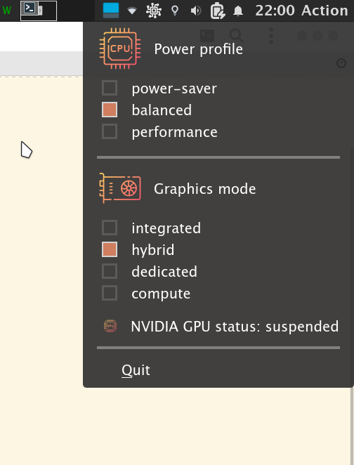

# Introduction

This is a simple tray widget which lets the user change their Asus-ROG laptop power profiles and graphics mode.

## Features

Supported features are:
* Change power profiles
* Change graphics mode
* Display discrete GPU status

# Requirements

An Asus-ROG laptop is required (tested on Asus Zephyrus G14 2021).

This project depends on:
- python >= 3   (tested with version 3.10.5)
- PyQt5
- powerprofilectl   (tested with version 0.11.1)
- supergfxctl  (tested with version 4.0.4)

# Usage

To start the tray widget:
```bash
python launch.py
```

It is recommended to launch this widget application at startup.

# Screenshots



# Credits
Icons contained in icons/ directory are made by **Good Ware** on [flaticon](https://www.flaticon.com/).
They are under flaticon license.
Icons used in this project are from those packs: [1](https://www.flaticon.com/packs/computers-13), [2](https://www.flaticon.com/packs/technology-27)

# License
The code is under MIT License.

# Alternatives

[asusctl-gex](https://asus-linux.org/asusctlgex/), [asusctltray](https://github.com/Baldomo/asusctltray)
